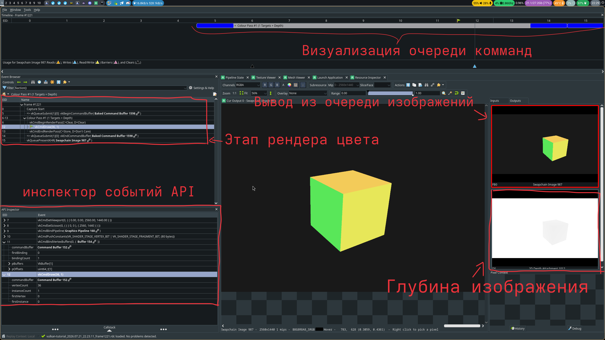
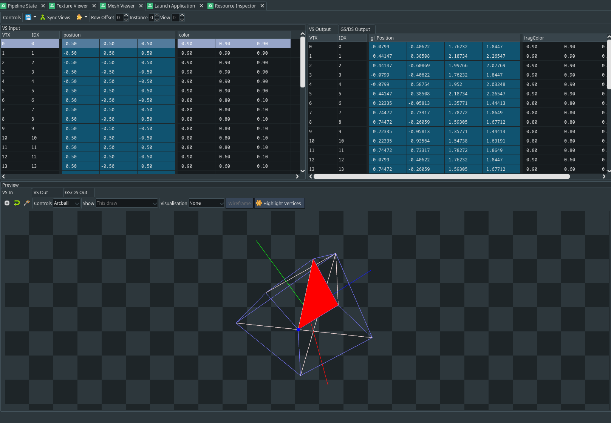
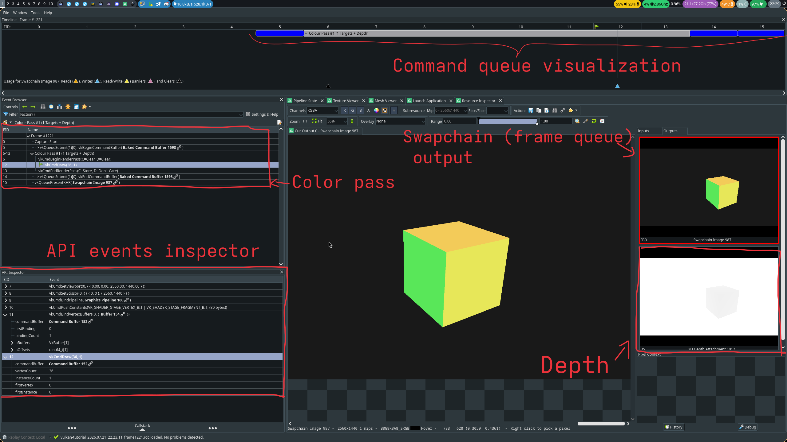

# Vulkan 3D Engine

## RU:

Визуализация 3D-графики в реальном времени с использованием Vulkan API.

Vulkan — самый низкоуровневый и сложный из современных графических API. В отличие от OpenGL, разработчик вручную управляет синхронизацией GPU, видеопамятью, буферами команд и графическим конвейером. Проект написан для понимания этих механизмов на практике.

## Учебный проект для изучения GPU, графических API, шейдеров и математики за ними
Полезные ресурсы:
- [3b1b курс по линейной алгебре](https://www.youtube.com/watch?v=fNk_zzaMoSs&list=PLZHQObOWTQDPD3MizzM2xVFitgF8hE_ab)
- [Vulkan guide](https://vkguide.dev/)
- [Vulkan документация (официальная)](https://docs.vulkan.org/)

## Возможности
- 3D-камера с перспективной проекцией, матрицами вида и модели
- Поддержка GLSL шейдеров (вершинные и фрагментные)
- Кроссплатформенная сборка
- Отладка GPU-пайплайна через RenderDoc

## Roadmap
- [ ] Compute-шейдеры для параллельных вычислений
- [ ] Текстурный маппинг
- [ ] Поддержка Vulkan-расширений
- [ ] Загрузка моделей

### отладка рендера движка и вызовов в Vulkan через RenderDoc (пример с простым 3D кубом):


Model geometry debug: vertex inspection:



### Технологический стек
C++20, Vulkan API, CMake, GLSL

### Требования для сборки:
- C++20, установленный Vulkan API
- компилятор: GCC или Clang
- cmake
- just (опционально, для удобства)

### Разработка:
```sh
just setup
just build
just run
```


## ENGLISH:

3D graphics visualization in realtime using Vulkan API.

Vulkan is the most low-level and complex of modern graphics APIs. Unlike OpenGL, the developer manually manages GPU synchronization, video memory, command buffers, and the graphics pipeline. This project was written to understand these mechanisms in practice.

## Learning project for exploring GPU, graphics APIs, shaders and math behind it
Useful resources:
- [3b1b linear algebra course](https://www.youtube.com/watch?v=fNk_zzaMoSs&list=PLZHQObOWTQDPD3MizzM2xVFitgF8hE_ab)
- [Vulkan guide](https://vkguide.dev/)
- [Vulkan documentation (official)](https://docs.vulkan.org/)

## Features
- 3D-camera with perspective with projection, view and model matrices
- GLSL shaders support (vertex and fragment)
- cross-platform build
- GPU pipeline debugging with RenderDoc app

## Roadmap
- [ ] Compute-shaders for parallel computation
- [ ] Texture Mapping
- [ ] Vulkan extensions support
- [ ] models loading

### engine and Vulkan calls debugging with RenderDoc (example with simple 3D cube):


Отладка геометрии модели: просмотр вершин:


### Tech stack
C++20, Vulkan API, CMake, GLSL

### Building requirements:
- C++ 20, Vulkan API installed
- compiler: GCC or Clang
- cmake
- just (optional for convenience)

### Development:
```sh
just setup
just build
just run
```

### You can use RenderDoc for GPU pipeline debugging. For Linux config see [RenderDoc-example.cap](./RenderDoc-example.cap)

### Release
```sh
just setup-release
just build-release
just run-release
```
